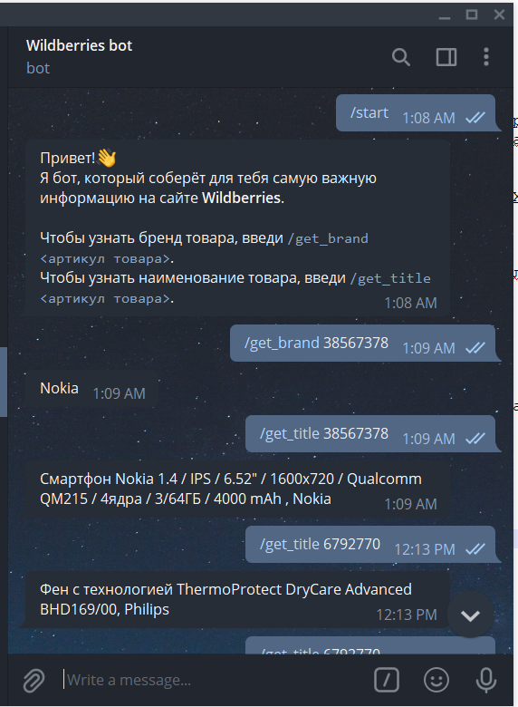
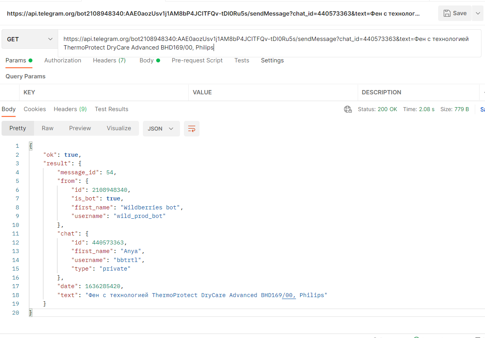

# Telegram-бот сбора данных с Wildberries

### Задача

> Разработать Telegram-бота сбора данных с Wildberries, который на вход получает одну из двух команд.

- `/get_brand 38567378` – аргументом указывается артикул товара, бот присылает сообщение с названием бренда, по указанному артикулу.
- `/get_title 38567378` – аргументом также указывается артикул товара, бот присылает сообщение с наименованием товара, по указанному артикулу.

	
Пример страницы с которой необходимо собрать информацию: [https://www.wildberries.ru/catalog/38567378/detail.aspx?targetUrl=XS](https://www.wildberries.ru/catalog/38567378/detail.aspx?targetUrl=XS)

### Задания со звёздочкой:

- Найти такой HTTP-запрос, который присылает данные в JSON-формате, содержащие наименование и бренд поданного на вход артикула.
- Сохранить получаемую информацию в произвольном формате в sqlite3 или MongoDB. В случае с MongoDB, нет большой нужды где-то разворачивать её сервер, можно просто написать код, предполагающий сохранение.

---

### Выполнение

Задача была выполнена на Python 3.8 с использованием библиотеки python-telegram-bot для создания бота, а также библиотеки BeautifulSoup4 для сбора нужной информации с веб-страниц.

Работа бота представлена на рисунке:

- В файле `bot.py` находится выполнение основной задачи
- В файле `db_bot.py` задача дополнена функцией сохранения получаемой информации в реляционную базу данных в sqlite3.
- `schema.sql` - файл с sql-кодом для создания таблиц (`product` и `brand`).
- `products_sqlite.db` - файл базы данных sqlite3

HTTP-запрос, который присылает данные в JSON-формате, содержащие наименование и бренд поданного на вход артикула: GET-метод `sendMessage` (обязательные параметры - `chat_id` и `text`).
Пример выполнения запроса представлен на рисунке:

